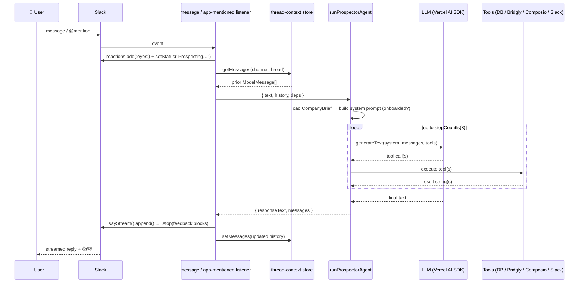
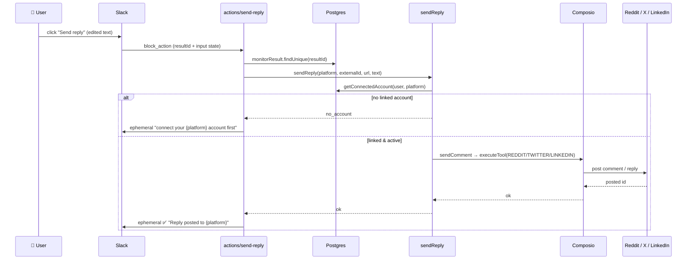
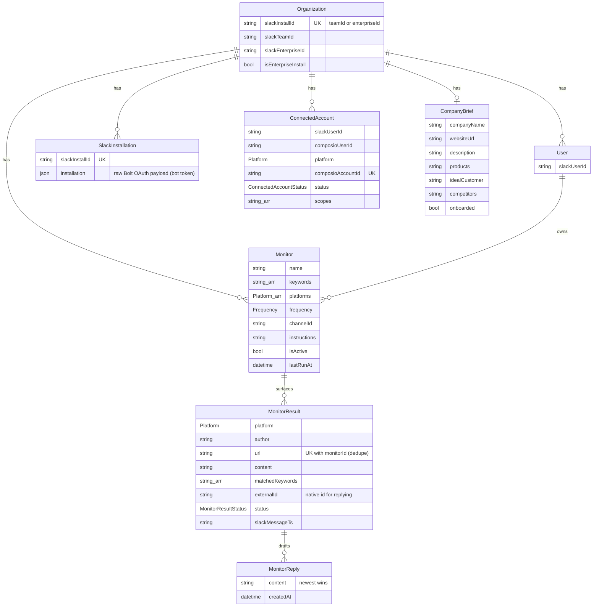

# ⛏️ Prospector — Architecture

Prospector is a **social-listening and lead-generation agent that lives entirely in Slack**. Teams create _monitors_ (keywords + platforms + frequency + a target Slack channel + optional filter instructions). On a schedule, Prospector searches Reddit, LinkedIn, and X, uses an LLM to qualify real leads, drafts a reply in the customer's voice, posts a lead card into Slack, and lets the user send that reply back to the source platform through their own connected account.

Built for the **Slack Agent Builder Challenge — _Slack Agent for Organizations_** track. It leans on **Slack AI capabilities** (agent view, assistant threads, streaming, suggested prompts, feedback) and runs as a fully multi-workspace, OAuth-installable Marketplace app.

- **Runtime:** Node 24 (native TypeScript, no build step), Bolt for JavaScript v4 in **HTTP + OAuth** mode
- **AI:** Vercel AI SDK — default `vertex:gemini-2.5-pro` (Anthropic Claude / Google Gemini pluggable)
- **Persistence:** Postgres via Prisma 7 (`@prisma/adapter-pg`)
- **Search (read):** Bridgly API — Reddit / X / LinkedIn post search
- **Reply (write) + OAuth:** Composio — per-user connected accounts, tool execution
- **Scheduling:** in-process `croner`, one cron job per monitor
- **Deploy:** Railway at `https://prospector.withsia.com` (ngrok for local dev)

---

## 1. System context — components & external services

```mermaid
flowchart TB
    subgraph Slack["🟣 Slack Platform"]
        SlackUser["👤 User<br/>DM · @mention · Assistant panel · App Home"]
        SlackChannel["#️⃣ Monitor channel<br/>(receives lead cards)"]
        SlackAPI["Slack Web API + Events + Interactivity"]
    end

    subgraph App["⛏️ Prospector — Node 24 · Bolt HTTP+OAuth (app.ts)"]
        direction TB

        subgraph Listeners["listeners/ — Slack handlers"]
            EvMsg["events/message<br/>DMs + engaged threads"]
            EvMention["events/app-mentioned<br/>@Prospector in channels"]
            EvHome["events/app-home-opened<br/>Home view + suggested prompts"]
            AcFeedback["actions/feedback-buttons<br/>👍 / 👎"]
            AcSend["actions/send-reply<br/>'Send reply' button"]
        end

        subgraph Agent["agent/ — AI orchestration (Vercel AI SDK)"]
            Prospector["prospector.ts<br/>runProspectorAgent()<br/>system prompt + generateText + stepCountIs(8)"]
            Model["model.ts · resolveModel()"]
            Filter["filter.ts · filterHits()<br/>generateObject lead qualifier"]
            Reply["reply.ts · generateReply()<br/>drafts reply in company voice"]
            CompanyCtx["company-context.ts<br/>renderCompanyBrief / isBriefUsable"]
            subgraph Tools["tools/ — AI SDK tool()s"]
                TMon["monitors: create/list/edit/delete"]
                TCompany["company: get/set_company_brief"]
                TConn["connections: connect/list/disconnect_account"]
                TChan["channels: list_slack_channels"]
                TLeads["leads: get_recent_leads · draft_reply (stub)"]
                TResults["results: get_latest_results"]
            end
        end

        subgraph Cron["cron/ — in-process scheduler"]
            Scheduler["scheduler.ts<br/>startScheduler / registerMonitor<br/>Map&lt;monitorId, Cron&gt;"]
            Schedule["schedule.ts<br/>buildMonitorCron(freq, createdAt)"]
            Workflow["workflow.ts · runMonitor()<br/>scan → filter → draft → post"]
        end

        subgraph SlackOut["slack/ — outbound to Slack"]
            PostLead["post-lead.ts · postLead()"]
            Blocks["blocks.ts · buildLeadBlocks()<br/>lead card + editable reply + Send button"]
            SendReply["send-reply.ts · sendReply()"]
            Token["token.ts · getBotClient()"]
        end

        subgraph BridglyMod["bridgly/ — social search"]
            BClient["client.ts (api.bridgly.app)"]
            BSearch["search.ts · searchKeywords()<br/>reddit / x / linkedin → SocialHit[]"]
        end

        subgraph Integrations["integrations/ — Composio (OAuth + write)"]
            IClient["client.ts"]
            IConnect["connect.ts · startConnection / handleOAuthCallback"]
            IExec["execute.ts · executeTool()"]
            IComment["comment.ts · sendComment()<br/>REDDIT/TWITTER/LINKEDIN tool ids"]
            IAccounts["accounts.ts"]
            ICallback["callback-route.ts<br/>GET /integrations/callback"]
        end

        subgraph Data["db/ + prisma/ — persistence"]
            DBClient["client.ts (Prisma)"]
            InstallStore["installation-store.ts<br/>Bolt InstallationStore"]
            DBMon["monitors.ts"]
            DBRes["results.ts"]
            DBBrief["company-brief.ts"]
        end

        ThreadCtx["thread-context/store.ts<br/>in-memory ModelMessage[] per thread<br/>(TTL 24h)"]
        Env["util/env.ts · zod-validated config"]
    end

    subgraph External["☁️ External services"]
        Bridgly["Bridgly API<br/>Reddit · X · LinkedIn search"]
        Composio["Composio<br/>OAuth + tool execution"]
        LLM["LLM providers<br/>Vertex Gemini · Anthropic · Google"]
        PG[("Postgres<br/>Prisma 7")]
        Social["🌐 Reddit · LinkedIn · X"]
    end

    SlackUser -->|events / interactivity| SlackAPI
    SlackAPI --> EvMsg & EvMention & EvHome & AcFeedback & AcSend

    EvMsg --> Prospector
    EvMention --> Prospector
    EvMsg <--> ThreadCtx
    EvMention <--> ThreadCtx

    Prospector --> Model --> LLM
    Prospector --> Tools
    Prospector --> CompanyCtx
    TMon --> DBMon
    TMon --> Scheduler
    TCompany --> DBBrief
    TConn --> IConnect
    TConn --> IAccounts
    TChan --> SlackAPI
    TResults --> DBRes

    Scheduler --> Schedule
    Scheduler --> Workflow
    Workflow --> BSearch
    Workflow --> Filter --> Model
    Workflow --> Reply --> Model
    Workflow --> DBRes
    Workflow --> DBBrief
    Workflow --> PostLead
    PostLead --> Blocks
    PostLead --> Token
    Token --> DBClient
    PostLead -->|chat.postMessage| SlackChannel

    BSearch --> BClient --> Bridgly --> Social

    AcSend --> SendReply --> IComment --> IExec --> IClient --> Composio --> Social
    SendReply --> IAccounts

    IConnect --> Composio
    Composio -->|OAuth redirect| ICallback --> IConnect --> IAccounts

    InstallStore --> DBClient
    DBMon --> DBClient
    DBRes --> DBClient
    DBBrief --> DBClient
    IAccounts --> DBClient
    DBClient --> PG

    SlackAPI -->|OAuth install| InstallStore
    Filter --> LLM
    Reply --> LLM
```

---

## 2. Conversational flow (chat with the agent)

A user talks to Prospector in a DM, an `@mention`, or the Assistant panel. Bolt streams the reply back with a loading status and feedback buttons.

Key detail: the AI SDK is **stateless**, so full `ModelMessage[]` history is kept client-side in an in-memory map keyed by `channelId:threadTs` (24h TTL). A non-null history also marks the bot as "engaged" in a channel thread.

---

## 3. Monitor pipeline (the core cron loop)

Each active monitor gets its own `croner` job (minute/hour anchored to creation time to spread load). Every tick runs `runMonitor()`.

```mermaid
flowchart LR
    Tick["⏰ croner tick<br/>(hourly / 6h / daily)"] --> Run["runMonitor(monitorId)"]
    Run --> Ctx["getMonitorRunContext<br/>load monitor + installId"]
    Ctx --> Active{isActive?}
    Active -->|no| Stop([skip])
    Active -->|yes| Search["searchKeywords()<br/>platform × keyword fan-out"]
    Search --> Bridgly["Bridgly API<br/>reddit / x / linkedin"]
    Bridgly --> Hits["SocialHit[] deduped by URL<br/>+ matchedKeywords"]
    Hits --> Brief["getCompanyBrief"]
    Brief --> FilterStep["filterHits()<br/>LLM qualifies real leads<br/>(fails safe → post nothing)"]
    FilterStep --> Loop{for each<br/>qualified hit}
    Loop --> Dedup["createResultIfNew<br/>unique(monitorId, url)"]
    Dedup -->|duplicate| Skip([skip lead])
    Dedup -->|new| Draft["generateReply()<br/>LLM drafts in company voice"]
    Draft --> SaveReply["createReply → MonitorReply"]
    SaveReply --> Post["postLead()<br/>buildLeadBlocks + getBotClient"]
    Post --> Card["#️⃣ Lead card in Slack channel<br/>quote + editable reply + Send button"]
    Card --> Ts["setResultSlackTs"]
    Ts --> Loop
    Loop --> Mark["markMonitorRun(lastRunAt)"]
```

- **Fails safe:** if the LLM filter errors, the run aborts before posting so the channel is never flooded with unfiltered noise.
- **Idempotent:** `@@unique([monitorId, url])` dedupes across runs, so only genuinely new leads are surfaced. The first scan is kicked off immediately at creation.

---

## 4. Send a reply back to the source platform

Lead cards carry an editable text box (pre-filled with the drafted reply) and a **Send reply** button. Sending posts the reply through the clicking user's own Composio-connected account.

Composio tool ids used: `REDDIT_POST_REDDIT_COMMENT`, `TWITTER_CREATION_OF_A_POST`, `LINKEDIN_GET_MY_INFO` + `LINKEDIN_CREATE_COMMENT_ON_POST`. Native ids (Reddit fullname `t3_…`, tweet id, LinkedIn URN) are resolved from the stored `externalId` or the post URL.

---

## 5. Install & account-connect (OAuth flows)

```mermaid
flowchart TB
    subgraph InstallFlow["Slack app install (per workspace)"]
        I1["/slack/install"] --> I2["Slack OAuth consent"]
        I2 --> I3["/slack/oauth_redirect"]
        I3 --> I4["InstallationStore.storeInstallation<br/>upsert Organization + SlackInstallation + User"]
        I4 --> I5[("Postgres<br/>bot token per workspace")]
    end

    subgraph ConnectFlow["Connect social account (per user)"]
        C1["connect_account tool<br/>startConnection()"] --> C2["Composio initiate<br/>authConfig per platform"]
        C2 --> C3["provider authorization URL"]
        C3 --> C4["user authorizes on Reddit / X / LinkedIn"]
        C4 --> C5["GET /integrations/callback<br/>handleOAuthCallback()"]
        C5 --> C6["upsertConnectedAccount<br/>composioUserId = installId__slackUserId"]
        C6 --> C7[("Postgres · ConnectedAccount")]
    end
```

Installs are keyed by a stable **install id** (`teamId`, or `enterpriseId` for org-wide Enterprise Grid installs — `org_deploy_enabled: true`). The cron worker runs outside the Bolt request cycle, so `getBotClient()` reads the stored bot token from `SlackInstallation` to post leads.

---

## 6. Data model (Prisma / Postgres)

Enums: `Platform {reddit, linkedin, x}`, `Frequency {hourly, every_6_hours, daily}`, `MonitorResultStatus {new, dismissed}`, `ConnectedAccountStatus {active, expired, inactive}`.

---

## 7. Slack surface (manifest.json)

| Aspect            | Value                                                                                                                                                                       |
| ----------------- | --------------------------------------------------------------------------------------------------------------------------------------------------------------------------- |
| **Bot scopes**    | `app_mentions:read`, `assistant:write`, `reactions:write`, `chat:write`, `channels:read`, `groups:read`, `channels:history`, `groups:history`, `im:history`, `mpim:history` |
| **Features**      | `agent_view` (agent description + 3 suggested prompts), `app_home` (Home + Messages tabs), `bot_user` (always online)                                                       |
| **Bot events**    | `app_home_opened`, `app_mention`, `message.channels`, `message.groups`, `message.im`, `message.mpim`                                                                        |
| **Interactivity** | enabled → `/slack/events`                                                                                                                                                   |
| **Mode**          | HTTP + OAuth (`socket_mode_enabled: false`), `org_deploy_enabled: true`, no token rotation, `is_mcp_enabled: false`                                                         |
| **Endpoints**     | `POST /slack/events` · `/slack/install` → `/slack/oauth_redirect` · `GET /integrations/callback`                                                                            |

**Slack AI capabilities used:** assistant/agent view, `setStatus()` loading messages, `setSuggestedPrompts()` pinned prompts, `sayStream()` streamed markdown responses, and `context_actions` feedback buttons.

---

## 8. Configuration (util/env.ts — zod-validated at boot)

| Variable                                                                                                  | Purpose                                                         |
| --------------------------------------------------------------------------------------------------------- | --------------------------------------------------------------- |
| `DATABASE_URL`                                                                                            | Postgres (Prisma)                                               |
| `SLACK_CLIENT_ID` / `SLACK_CLIENT_SECRET` / `SLACK_SIGNING_SECRET`                                        | Slack app credentials                                           |
| `SLACK_REDIRECT_URI` / `SLACK_STATE_SECRET`                                                               | OAuth install flow                                              |
| `PROSPECTOR_MODEL`                                                                                        | `provider:model-id` (default `vertex:gemini-2.5-pro`)           |
| `GOOGLE_VERTEX_PROJECT` / `GOOGLE_VERTEX_LOCATION` / `ANTHROPIC_API_KEY` / `GOOGLE_GENERATIVE_AI_API_KEY` | LLM provider credentials                                        |
| `BRIDGLY_API_KEY`                                                                                         | Bridgly social search                                           |
| `COMPOSIO_API_KEY`                                                                                        | Composio OAuth + tool execution                                 |
| `COMPOSIO_AUTH_CONFIG_REDDIT` / `_LINKEDIN` / `_TWITTER`                                                  | per-platform Composio auth configs                              |
| `PUBLIC_BASE_URL`                                                                                         | OAuth callback origin (defaults to `SLACK_REDIRECT_URI` origin) |
| `PORT` / `LOG_LEVEL`                                                                                      | server + logging                                                |

---

## 9. Technology summary

| Layer                | Technology                                                                            |
| -------------------- | ------------------------------------------------------------------------------------- |
| Runtime              | Node 24 (native TypeScript, no build step)                                            |
| Slack framework      | Bolt for JavaScript v4 (HTTP + OAuth), `@slack/web-api`                               |
| AI                   | Vercel AI SDK (`ai`) + `@ai-sdk/google-vertex`, `@ai-sdk/anthropic`, `@ai-sdk/google` |
| Social search (read) | Bridgly (`bridgly` SDK)                                                               |
| Social write + OAuth | Composio (`@composio/core`)                                                           |
| Database             | Postgres + Prisma 7 (`@prisma/adapter-pg`)                                            |
| Scheduling           | `croner` (in-process, one job per monitor)                                            |
| Validation           | Zod (config, tool schemas, DB mirrors, trust boundaries)                              |
| Deploy               | Railway (`prospector.withsia.com`); ngrok for local dev                               |
